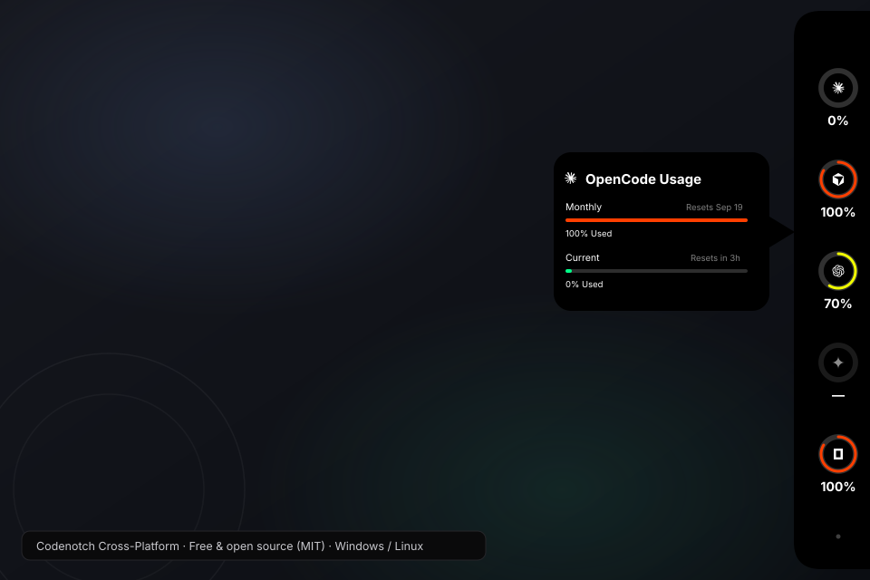
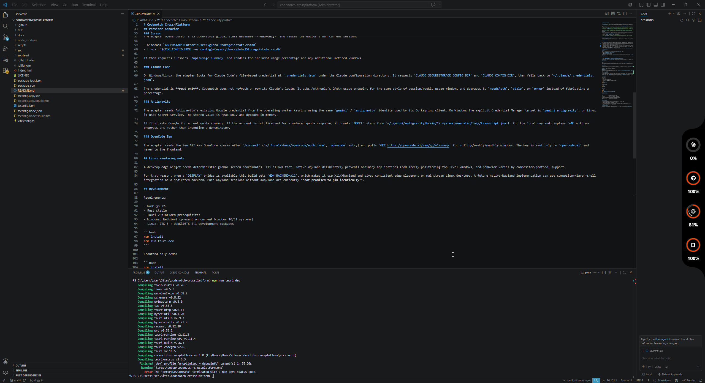

# Codenotch Cross-Platform

[](LICENSE)
[](https://github.com/thomaslittle/codenotch-crossplatform/releases)
[](https://github.com/thomaslittle/codenotch-crossplatform/releases)

A Windows and Linux port of the **interaction and visual concept** from [vinzdg/codenotch](https://github.com/vinzdg/codenotch): a small notch attached to a screen edge that shows coding-assistant usage at a glance and expands into a detailed usage card on hover.

> **Where this came from:** the entire idea is [vinzdg](https://github.com/vinzdg)'s — this repo is literally just a couple of AI prompts because the concept deserved to exist on Windows and Linux too. All credit for the idea and design goes to the original creator; go star [vinzdg/codenotch](https://github.com/vinzdg/codenotch). No confusion intended: nothing here was our idea, we just wanted it on other operating systems. This is an independent clean-room implementation (new Rust + React code, no upstream source copied) and is not affiliated with or endorsed by the upstream project.

> **Clean-room note:** the upstream repository did not contain a license file when this project was created. This repository therefore does **not** copy its Swift/AppKit source, screenshots, icons, or other assets. If upstream later publishes a license, this note can be revisited. Provider logos shown in the UI are the vendors' own marks, used for identification only.

## Download

Grab the latest build from the [**Releases page**](https://github.com/thomaslittle/codenotch-crossplatform/releases):

- **Windows:** `Codenotch_*_x64-setup.exe` installer (Windows 10/11 + WebView2)
- **Linux:** `.AppImage` (portable) or `.deb` (Debian/Ubuntu)

The app also checks GitHub releases on launch and tells you right in Settings (plus a green dot on the settings orb) when a new version is out, with a one-click download button.

> **Linux testers wanted:** this has only ever run on Windows so far. If you're on Linux, please try a release and [open an issue](https://github.com/thomaslittle/codenotch-crossplatform/issues) with whatever breaks — desktop environment, distro, and logs included.

## Free and open source, no big deal

This is **MIT licensed and free forever** — use it, fork it, rip pieces out of it, whatever. If you want something changed, **pull requests are very welcome**: fork, branch, open a PR, and it'll get reviewed. Bug reports with logs and repro steps are just as appreciated. No CLA, no process, no drama.





## What we added on top

We got creative with the original idea and kept building: a fifth provider (**OpenCode Zen**), a full theming engine (**dark / light / system** plus any custom surface color with auto-contrast text), notch **opacity**, **scaling**, screen-edge **nudges** with per-monitor placement, opt-in **auto-hide** with a configurable idle delay and hover-to-peek edge sliver, springy motion throughout, an in-app **update checker**, a dev mode that reads your real local usage (never demo numbers), and honest `stale`/`needsAuth` statuses instead of invented percentages. If you think of more customization, open a PR.

## What is implemented

- Windows 10/11 and Linux desktop shell using **Tauri 2 + Rust + React/TypeScript**.
- The same core visual language: black edge notch, 44px provider rings, used-percent labels, green/yellow/orange usage bands, hover detail card, provider reset windows, and a settings orb.
- Placement on the **right, left, top, or bottom** edge of any monitor, with X/Y nudge, per-monitor choice, and notch scaling (70–130%).
- Optional **auto-hide** (off by default): after a configurable idle delay the notch retracts to a small edge sliver; moving the cursor back to that edge peeks it out again. The hidden window becomes click-through so it does not block the app underneath.
- Separate notch, tooltip, context-menu, and settings windows so transparent desktop areas do not swallow pointer input.
- Always-on-top, frameless, taskbar-hidden notch behavior.
- Provider adapters for **Claude Code, Cursor, Codex, Antigravity, and OpenCode Zen**.
- Themeable notch: **dark / light / system** modes plus any custom surface color (text auto-contrasts), adjustable opacity, springy motion throughout, and honest statuses instead of invented numbers.
- Hover detail card with your real limit windows and reset times; the pointer is part of the card so it never seams or flashes.
- Settings panel that sizes itself to fit its content (never scrolls, never clips) and drags by its header; one-click reset to defaults.
- 60-second refresh cadence with a local last-good snapshot cache. If a provider temporarily fails, the previous reading is marked stale instead of disappearing.
- Right-click menu: Settings, Refresh now, Hide for 1 hour, Quit.
- Browser dev mode (`npm run dev`) serves the same real local readings through a Vite `/api/snapshots` bridge (`scripts/dev-snapshots.mjs`), so no demo numbers are ever shown. Anything unreadable comes back with an honest status instead.

## Provider behavior

### Codex

Usage is read locally from the most recently modified `rollout-*.jsonl` under:

- Windows: `%USERPROFILE%\\.codex\\sessions\\...`
- Linux: `~/.codex/sessions/...`
- `CODEX_HOME` is respected when set.

The adapter uses Codex's own recorded `rate_limits` snapshots, including primary and secondary windows. `~/.codex/auth.json` is read only for the account label/plan; it is not needed to read usage.

### Cursor

The adapter opens Cursor's VS Code-style global state database **read-only** and reuses the editor's own current session:

- Windows: `%APPDATA%\\Cursor\\User\\globalStorage\\state.vscdb`
- Linux: `${XDG_CONFIG_HOME:-~/.config}/Cursor/User/globalStorage/state.vscdb`

It then requests Cursor's `/api/usage-summary` and renders the included-usage percentage and any additional metered windows.

### Claude Code

On Windows/Linux, the adapter looks for Claude Code's file-based credential at `.credentials.json` under the Claude configuration directory. It respects `CLAUDE_SECURESTORAGE_CONFIG_DIR` and `CLAUDE_CONFIG_DIR`, then falls back to `~/.claude/.credentials.json`.

The credential is **read only**. Codenotch does not refresh or rewrite Claude's login. It asks Anthropic's OAuth usage endpoint for the same style of session/weekly usage windows and degrades to `needsAuth`, `stale`, or `error` instead of fabricating a percentage.

### Antigravity

The adapter reads Antigravity's existing Google credential from the operating system keyring using the same `gemini` / `antigravity` identity used by its Go keyring client. On Windows the explicit Credential Manager target is `gemini:antigravity`; on Linux it uses Secret Service. The stored value is read only and decoded in memory.

It first asks Google for a real quota summary. If the account is not licensed for a metered quota response, it counts `MODEL` steps from `~/.gemini/antigravity/brain/*/.system_generated/logs/transcript.jsonl` for the local day and displays `~N` with no progress arc rather than inventing a denominator.

### OpenCode Zen

The adapter reads the Zen API key OpenCode stores after `/connect` (`~/.local/share/opencode/auth.json`, `opencode` entry) and polls `GET https://opencode.ai/zen/go/v1/usage` for rolling/weekly/monthly windows. The key is sent only to `opencode.ai` and never to the frontend.

## Linux windowing note

A desktop edge widget needs deterministic global screen coordinates. X11 allows that. Native Wayland deliberately prevents ordinary applications from freely positioning top-level windows, and behavior varies by compositor/protocol support.

For that reason, when a `DISPLAY` bridge is available this build sets `GDK_BACKEND=x11`, which makes it use X11/XWayland and gives consistent edge placement on mainstream Linux desktops. A future native-Wayland implementation can use compositor/layer-shell integration as a dedicated backend. Pure Wayland sessions without XWayland are currently **not promised to pin identically**.

## Development

Requirements:

- Node.js 22+
- Rust stable
- Tauri 2 platform prerequisites
- Windows: WebView2 (present on current Windows 10/11 systems)
- Linux: GTK 3 + WebKitGTK 4.1 development packages

```bash
npm install
npm run tauri dev
```

Frontend-only demo:

```bash
npm install
npm run dev
```

Tests/build:

```bash
npm run typecheck
npm test
npm run build
cargo test --manifest-path src-tauri/Cargo.toml
npm run tauri build
```

## Repository layout

```text
src/                    React UI and interaction layer
src/lib/                usage formatting, settings, Tauri bridge
src/views/              notch, tooltip, settings, context menu
src-tauri/src/providers provider-specific Windows/Linux readers
src-tauri/src/windows.rs desktop window sizing and edge placement
.github/workflows/      Windows + Linux build/test CI
docs/                    architecture and platform notes
```

## Security posture

- Provider credentials are read only; this project does not own or refresh them.
- Cursor SQLite is opened read-only.
- Codex usage comes from local logs and needs no secret.
- Browser opening is restricted in the Rust command layer to the five known provider domains.
- The last-good snapshot cache contains display data only; provider tokens are never serialized into it.
- No provider token is sent to the React frontend.

## Upstream inspiration

This project is an independent reimplementation inspired by the public UX/specification of `vinzdg/codenotch`. It is not an upstream fork and contains no upstream Swift implementation.
